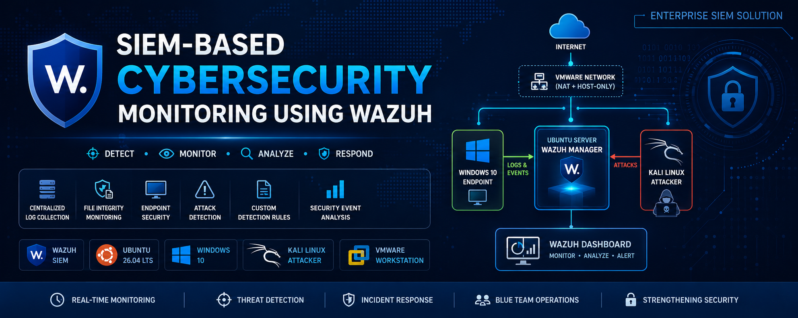

<p align="center">
  
</p>

<h1 align="center">
SIEM-Based Cybersecurity Monitoring Using Wazuh
</h1>

<p align="center">
Enterprise SIEM implementation using Wazuh for centralized log collection, file integrity monitoring (FIM), endpoint security monitoring, attack simulation, custom detection rules, and security event analysis.
</p>

<p align="center">


</p>

---

## 📌 Project Overview

This project demonstrates the deployment of an enterprise Security Information and Event Management (SIEM) solution using **Wazuh** in a virtualized cybersecurity laboratory. The environment consists of an Ubuntu-based Wazuh Server, a Windows 10 endpoint, and a Kali Linux attacker machine connected through an isolated virtual network.

The project focuses on monitoring endpoint activities, collecting security logs, detecting cyberattacks, creating custom detection rules, and analyzing security events using the Wazuh Dashboard.

---

## 🎯 Objectives

- Deploy a centralized SIEM platform using Wazuh
- Configure centralized log collection
- Implement File Integrity Monitoring (FIM)
- Monitor Windows and Linux endpoints
- Simulate real-world cyberattacks
- Create custom Wazuh detection rules
- Analyze security events using the Wazuh Dashboard

---

## 🌟 Project Highlights

- Enterprise SIEM deployment using Wazuh
- Ubuntu-based Wazuh Manager
- Windows 10 monitored endpoint
- Kali Linux attacker machine
- Centralized log collection
- File Integrity Monitoring (FIM)
- Endpoint Security Monitoring
- SSH authentication monitoring
- Nmap reconnaissance detection
- Hydra brute-force attack simulation
- Custom Wazuh detection rules
- MITRE ATT&CK mapped alerts
- Professional security event analysis

---

## 🛠 Technologies Used

- Wazuh SIEM
- Ubuntu Linux
- Windows 10
- Kali Linux
- VMware Workstation
- XML
- SSH
- Nmap
- Hydra
- Linux Administration

---

## 📂 Project Structure

```text
.
├── README.md
├── LICENSE
├── documentation/
│   └── Enterprise_SIEM_Wazuh_Project_Report.pdf
├── config/
│   ├── local_rules.xml
│   ├── ossec.conf
│   └── agent.conf
├── images/
│   └── banner.png
└── screenshots/
    └── (Project implementation screenshots)
```

---

## 🔐 Implemented Modules

### Module 1 – Centralized Log Collection

- Centralized log collection
- Windows Event Logs
- Linux System Logs
- SSH Logs
- Wazuh Dashboard monitoring

### Module 2 – File Integrity Monitoring (FIM)

- Critical file monitoring
- Real-time file change detection
- Integrity validation
- Security alert generation

### Module 3 – Endpoint Security Monitoring

Two cyberattack simulations were performed:

- SSH Brute Force Attack using Hydra
- Network Reconnaissance using Nmap

Custom Wazuh detection rules were developed to identify these attack activities and generate high-priority security alerts.

---

## 🛡 Custom Detection Rules

Two custom Wazuh detection rules were developed to improve threat visibility:

- **Rule ID 100100** – Detects SSH authentication failures.
- **Rule ID 100101** – Detects multiple SSH authentication failures within a defined time window, indicating a potential brute-force attack.

These rules increase the effectiveness of endpoint monitoring by generating high-priority alerts for suspicious authentication activities.

---

## 📊 Key Features

- Security Event Monitoring
- Real-time Alerting
- MITRE ATT&CK Mapping
- Custom Rule Development
- Endpoint Monitoring
- Attack Detection
- Security Log Analysis
- Dashboard Visualization

---

## 📖 Documentation

The complete project documentation is available as a downloadable PDF.

📄 **Download the Project Report**

👉 [SIEM Based Cybersecurity Monitoring Report (PDF)](https://raw.githubusercontent.com/Saim-Ali-Shahid/SIEM-Based-Cybersecurity-Monitoring-Using-Wazuh/main/Documentation/SIEM_Based_Cybersecurity_Monitoring_Report.pdf)

The report contains:

- Project objectives
- Lab environment setup
- Wazuh deployment
- Log Collection
- File Integrity Monitoring (FIM)
- Endpoint Security Monitoring
- Nmap attack simulation
- Hydra brute-force attack simulation
- Custom Wazuh detection rules
- Security event analysis
- Results and conclusions
## 👨‍💻 Author

**Saim Ali Shahid**

Cybersecurity Student | SIEM Enthusiast | SOC Analyst Aspirant | Blue Team | Threat Detection | Incident Monitoring

### 🌐 Connect with Me

- **GitHub:** https://github.com/Saim-Ali-Shahid
- **LinkedIn:** https://www.linkedin.com/in/saim-ali-shahid/

---

⭐ **If you found this project helpful, consider giving it a star on GitHub!**
---

## 📄 License

This project is licensed under the MIT License. See the `LICENSE` file for additional information.
```

